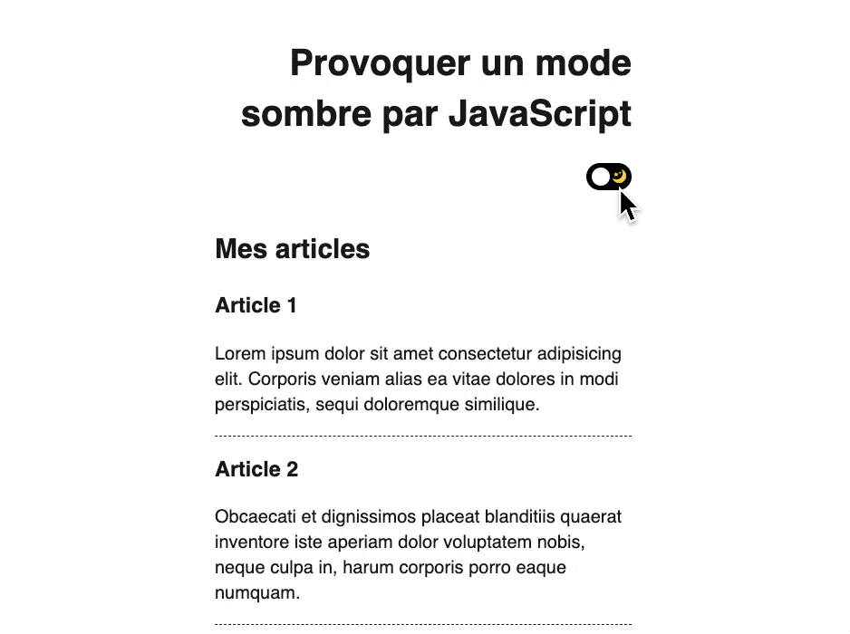

# Provoquer un mode sombre par JavaScript

> JS exercise given at HEPL

* * *

**js-tp-day-night-by-js** is an educational project, which will be used for `JS` courses.

**Note:** the school where the course is given, the [HEPL](http://www.provincedeliege.be/hauteecole) from Liège, Belgium, is a french-speaking school. From this point, the instruction will be in french. Sorry.

* * *

> Lors de vos cours de *web*, vous allez découvrir le langage *JavaScript* et le mettre en pratique pour apprendre à rendre vos pages web interactives.  

* * *
Dans le cadre de cet exercice, nous vous demandons de permettre à l'utilisateur de basculer vers un mode sombre. Bien entendu, les règles sont déjà définies dans la feuille de style. Vous devez ajouter les bonnes classes aux bons éléments.

## Énoncé

1. Au clic de l’élément `.tumbler__wrapper` vous devez ajouter les classes
2. `body--night-mode` à l'élément `body`
3. `tumbler--night-mode` à l’élément `.tumbler`
4. À tous les éléments `.post` la classe `post--night-mode`
5. Quand on clique une seconde fois il faut retirer les classes que vous venez d'ajouter

